[](https://deepwiki.com/lexmin0412/dify-chat)    

**Dify Chat**，一个基于 Dify API 的 AI Web 应用，支持单应用、多应用等多种模式，提供开箱即用的应用配置管理功能。支持运行不同类型的 Dify 应用，适配深度思考、思维链、图表等多种形式输出。

如果你觉得这个项目还不错的话，请动动你的小手指点个 Star ⭐️ 吧～

| 加群沟通（提需求/ bug 请带 issue 发言）                                                                                                              | 喂我花生（请在留言中备注自己的 Github 用户名哦）                                                                                                |
| ---------------------------------------------------------------------------------------------------------------------------------------------------- | ----------------------------------------------------------------------------------------------------------------------------------------------- |
|  |  |

## 🥇 Golden Sponsors

> 注：每日手动更新

| Avatar                                                                                                                          | Name                                                                          | Type   |
| ------------------------------------------------------------------------------------------------------------------------------- | ----------------------------------------------------------------------------- | ------ |
|                             | <a target="blank" href="https://github.com/forgoodthing">forgoodthing</a>     | Github |
|                             | <a target="blank" href="https://github.com/unmurphy">unmurphy</a>             | Github |
|                              | <a target="blank" href="https://github.com/wallowbear">打豆豆</a>             | Github |
|                              | <a target="blank" href="https://github.com/tangzp">tangzp</a>                 | Github |
|  | -1                                                                            | Wechat |
|                             | <a target="blank" href="https://github.com/HowieSh">HowieSh</a>               | Github |
|  | 北鱼                                                                          | Wechat |
|                             | <a target="blank" href="https://github.com/weihaoaho">weihaoaho</a>           | Github |
|  | xintan                                                                        | Wechat |
|                             | <a target="blank" href="https://github.com/zhaoweihan2015">zhaoweihan2015</a> | Github |
| None                                                                                                                            | 匿名慈善家                                                                    | Wechat |

## Repobeats


## 特性

- 📦 开箱即用：仅需 30 秒配置，即可开始使用
- 💬 随心所欲：支持单应用/多应用模式，满足不同企业级业务场景
- 💃 灵活部署：自身无任何后端依赖，可无缝对接 Dify Cloud 及私有化部署的 API 服务
- 📱 响应式设计：同时支持 PC 和移动端，双端功能同步
- 📝 支持渲染图片、视频、图表等丰富内容，让 AI 自由发挥
- 🔧 长期维护：日益增长的活跃社群，助力功能完善

## 子包列表

| 子包名称                | 描述            | 相关信息                                                                                                                                                                                                              | 文档                                                                                         |
| ----------------------- | --------------- | --------------------------------------------------------------------------------------------------------------------------------------------------------------------------------------------------------------------- | -------------------------------------------------------------------------------------------- |
| `@dify-chat/api`        | Dify API Client |                         | [packages/api/README.md](https://github.com/lexmin0412/dify-chat/tree/main/packages/api)     |
| `@dify-chat/core`       | 核心包          |                      | [packages/core/README.md](https://github.com/lexmin0412/dify-chat/tree/main/packages/core)   |
| `@dify-chat/theme`      | 主题包          |                   | [packages/theme/README.md](https://github.com/lexmin0412/dify-chat/tree/main/packages/theme) |
| `@dify-chat/helpers`    | 工具包          |             | 敬请期待...                                                                                  |
| `@dify-chat/components` | 核心 UI 组件库  |    | 敬请期待...                                                                                  |

## 运行截图

应用列表：

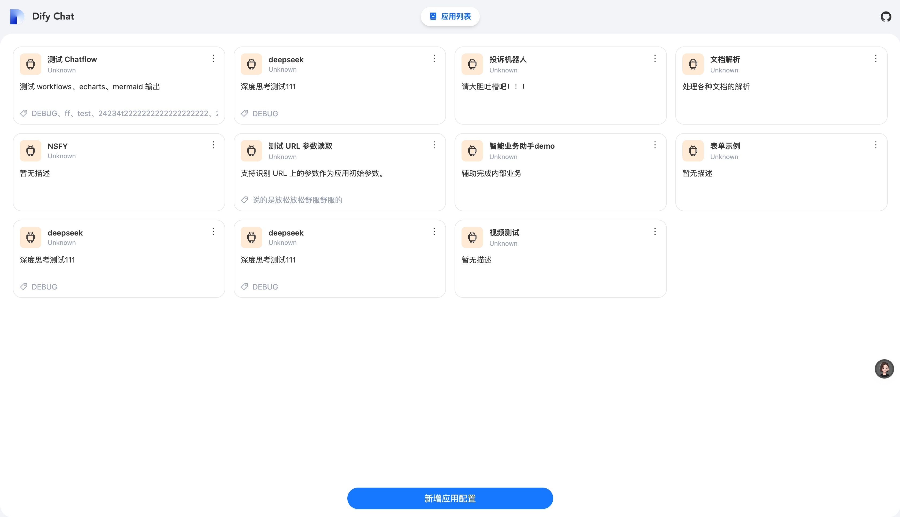

管理应用配置：

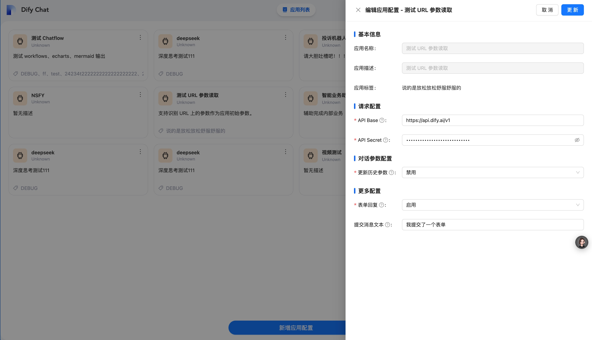

对话参数设置：

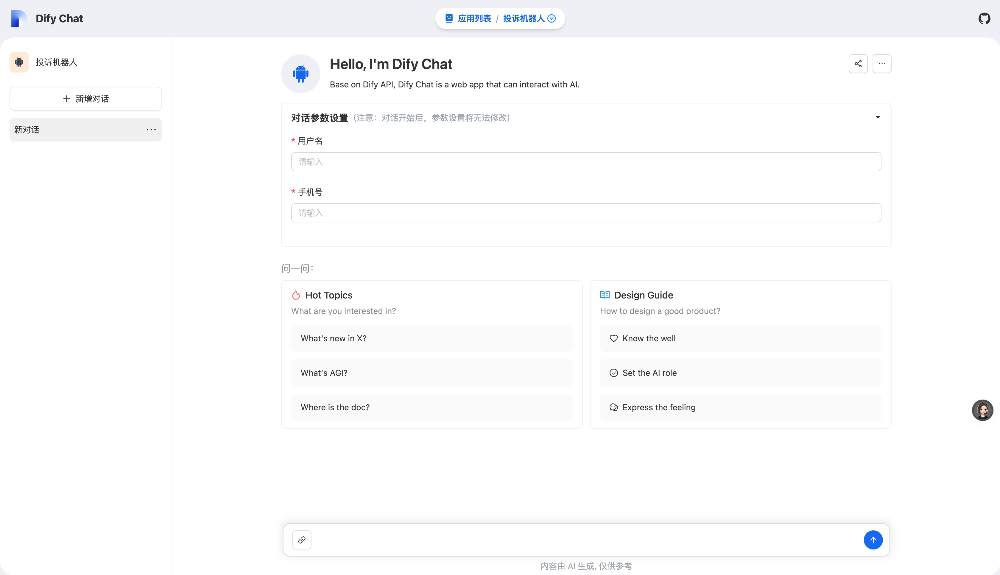

`<think>` 标签（DeepSeek 深度思考）：


Chatflow 工作流：


Agent 调用工具：

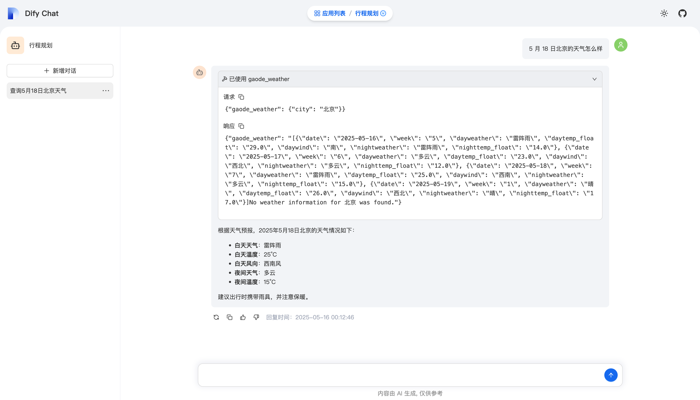

知识库引用链接：


`Echarts` 图表：


`Mermaid` 图表：

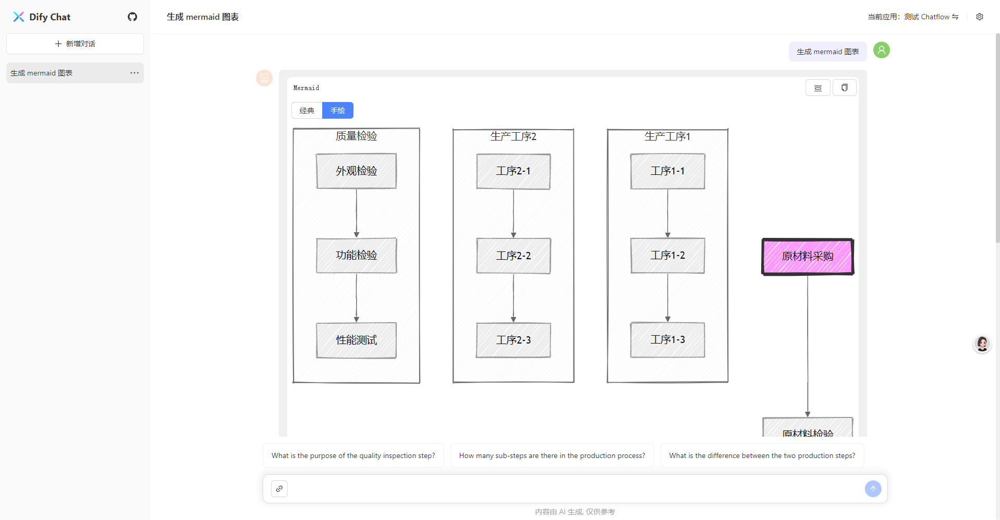

文档处理：


回复表单：


单应用模式：


移动端支持：

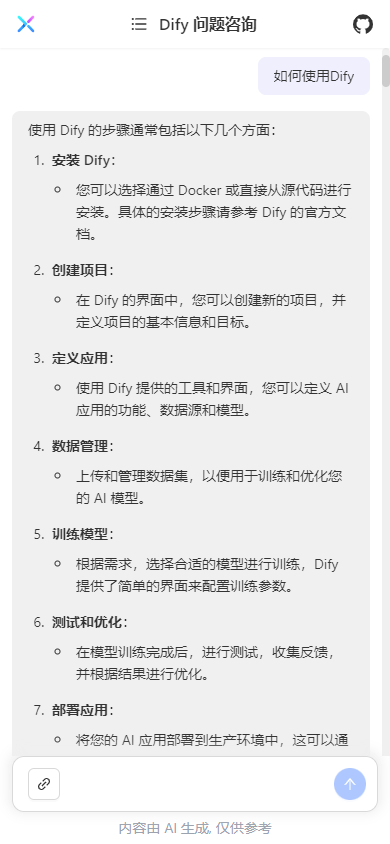

## 技术栈

- React v18
- Ant Design v5
- Ant Design X v1
- Rsbuild v1
- Tailwind CSS v3
- TypeScript v5

## 运行环境

开发/生产构建环境要求：

- Node.js ^22.5.1
- pnpm ^10.8.1

> 注意：本项目使用了 pnpm workspace 高级特性来实现 Monorepo 管理，其他包管理工具可能无法正常工作，请先确保你的环境满足以上要求。

## 开始使用

**注意：下文和文件路径相关的说明，均基于 packages/react-app 目录，如 `src/App.tsx`，实际路径为 `packages/react-app/src/App.tsx`。**

本项目支持两种开箱即用的使用方式：

- 单应用模式: 全局只有一个 Dify 应用，用户无需选择，可直接开始对话
- 多应用模式: 提供应用聚合列表页，支持用户选择不同的 Dify 应用，可根据业务需求灵活配置

## 0. 获取 Dify 应用配置

无论使用哪种模式，我们都需要对接 Dify API，你需要在 Dify 控制台获取几个关键变量：

| 变量     | 说明                                                                                   |
| -------- | -------------------------------------------------------------------------------------- |
| API Base | Dify API 请求前缀, 如果你使用的是 Dify 官方提供的云服务，则为 `https://api.dify.ai/v1` |
| Api Key  | Dify API 密钥，用于访问对应应用的 API, Dify 应用和 API 密钥是一对多的关系              |

进入 Dify 的应用详情，点击左侧的 `访问 API`：


`API 服务器` 后展示的域名即为 `API Base` 变量的值。

点击右侧的 `API 密钥` 按钮，即可看到 API Key 的管理弹窗：

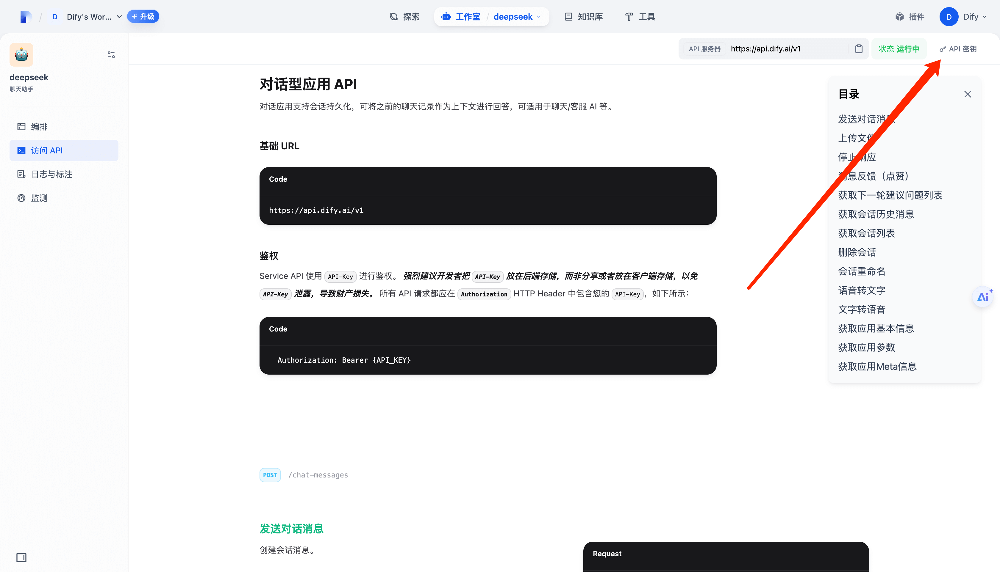

你可以选择创建一个新的 API Key，或者复制现有的 API Key。


完成以上步骤后，我们将会得到如下信息：

- API Base: `https://api.dify.ai/v1` OR `${SELF_HOSTED_API_DOMAIN}/v1`
- API Key: `app-YOUR_API_KEY`

### 1. 单应用模式

如果你全局只需要一个 Dify 应用, 不想让用户手动修改，可以使用单应用模式。


只需简单修改 `src/App.tsx` 中 `DifyChatProvider` 的属性即可：

```tsx
import { AppModeEnums } from "@dify-chat/core";

export default function App() {
  return (
    <DifyChatProvider
      value={{
        // 修改为单应用模式
        mode: "singleApp",
        // 用户id，可以获取业务系统的用户 ID，动态传入
        user: USER,
        // 单应用模式下，需要传入 appConfig 配置
        appConfig: {
          requestConfig: {
            apiBase: "上一步中获取到的 API Base",
            apiKey: "上一步中获取到的 API Key",
          },
          // 如果你使用的是聊天类型应用 (Chatbot/Chatflow/Agent), 则不需要定义 info.mode
          info: {
            mode: AppModeEnums.WORKFLOW,
          },
        },
      }}
    >
      子组件
    </DifyChatProvider>
  );
}
```

### 2. 多应用模式

如果你需要支持用户在界面上配置以及/或者切换多个 Dify 应用，多应用模式也是开箱即用的。

#### 2.1. 在界面上添加 Dify 应用配置

如果之前没有存量数据，第一次进入页面时会展示缺省状态，你需要点击页面底部的 "添加应用配置" 按钮：

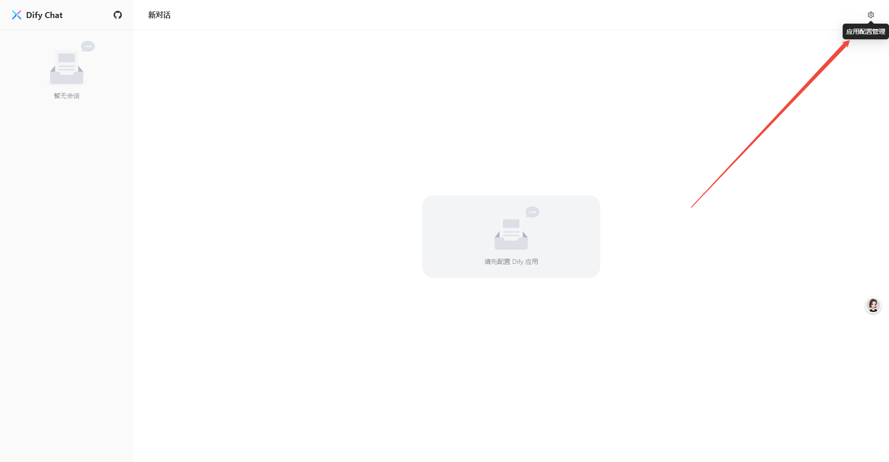

此时会弹出添加应用配置的表单抽屉：

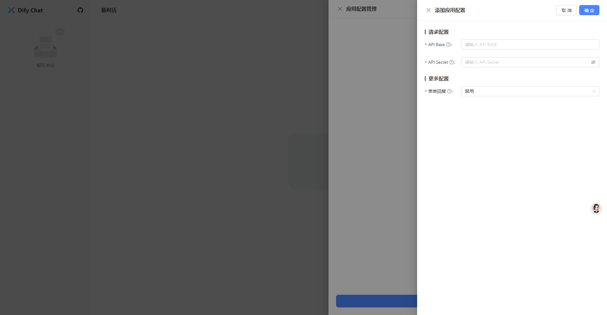

依次填入应用信息：

- 请求配置：在上一步中获取的 API Base 和 API Secret
- 应用类型：默认是聊天助手，如果是其他类型应用，需要切换到对应的类型
- 其他配置非必需，先保持默认值，后续需要再编辑即可

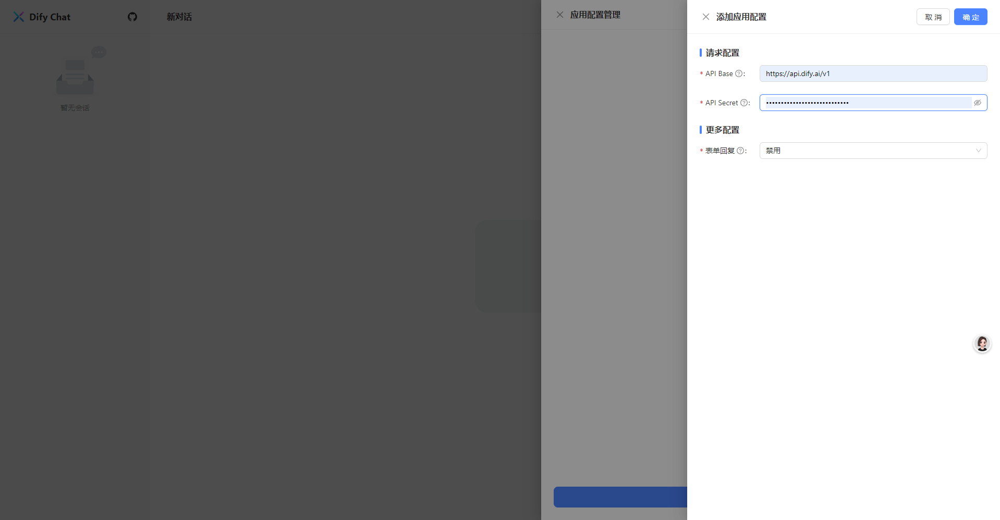

点击确定按钮，提示 “添加配置成功”，在应用列表中会多出一条数据：

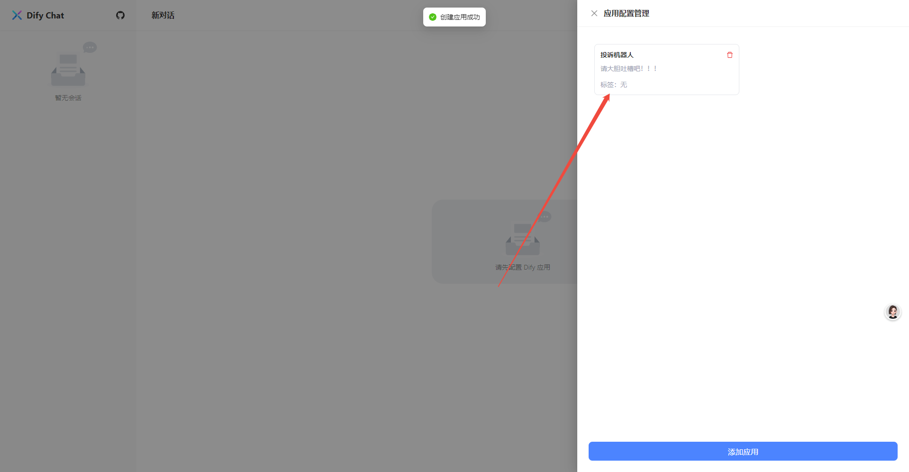

此时你可以点击应用卡片右上角的 "更多" 图标，对应用进行编辑和删除操作：


点击应用卡片，即可进入应用详情页开始对话：

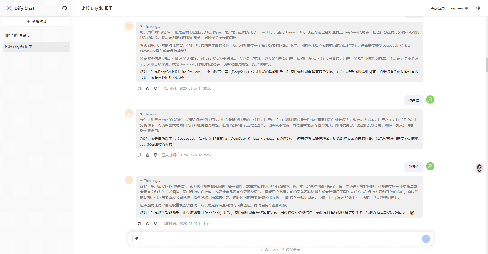

#### 2.2. 自定义应用配置管理服务 (按需)

**默认实现说明**

为方便演示, 本项目默认使用 LocalStorage 进行应用配置管理。

但实际在生产环境中，由于应用配置涉及 API Secret 等机密信息，我们一般会将应用数据存储在服务端，此时就需要接入后端服务来实现应用配置管理。

为方便使用方自定义, 应用配置管理的服务是通过 `src/App.tsx` 中的 `DifyChatProvider` 组件注入的:

```tsx
// src/App.tsx
import { DifyChatProvider } from "@dify-chat/core";

import DifyAppService from "./services/app/localstorage";

export default function App() {
  return (
    <DifyChatProvider
      value={{
        ...其他属性,
        appService: new DifyAppService(),
      }}
    >
      子组件
    </DifyChatProvider>
  );
}
```

在子组件中，会使用 `useDifyChat` 钩子获取在顶部注入的 `appService` 实例并调用相关方法实现应用配置的管理。

**自定义后端服务示例**

在 `"./services/app/restful.ts"` 文件有一个 Restful API 的最简实现, 你可以根据下面的步骤来进行体验：

1. 运行 `pnpm --filter dify-chat-app-server start` 启动后端服务
2. 将上面的 `DifyAppService` 导入路径换成 `"./services/app/restful"`
3. 运行 `pnpm dev` 启动前端应用, 访问 `http://localhost:5200/dify-chat`

**自定义后端服务实现**

如果需要自定义你的后端服务，请遵循以下步骤：

首先，参考 `packages/server`，实现以下接口：

- 获取 App 配置列表
- 获取 App 配置详情
- 添加 App 配置
- 更新 App 配置
- 删除 App 配置

然后在 `src/services/app` 中新建一个文件，只需要继承抽象类 `DifyAppStore` 并实现它的所有方法, 调用在上述服务中对应的接口即可。

**展示固定的应用列表数据**

如果你的应用列表是固定不变的，且不想通过后端接口实现，你可以按照如下步骤在代码中定义静态配置。

首先，在 `src/App.tsx` 中，修改 DifyAppService 的导入路径为 `"./services/app/static-readonly"`，并设置 `enableSetting` 为 `false`：

```tsx
// src/App.tsx
import DifyAppService from "./services/app/static-readonly";

export default function App() {
  return (
    <DifyChatProvider
      value={{
        mode: "multiApp",
        user: userId,
        appService: new DifyAppService(),
        // 固定数据不支持增删改，所以需要禁用应用配置权限
        enableSetting: false,
      }}
    >
      <LayoutIndex />
    </DifyChatProvider>
  );
}
```

然后在 `src/services/app/static-readonly/data.ts` 中，定义你的应用列表数据。里面预置了两条示例数据，你可以随意添加/修改。

> 注意：如果非本地开发模式，修改后需要重新构建方可生效。

```ts
// src/services/app/static-readonly/data.ts
import { AppModeEnums, IDifyAppItem } from "@dify-chat/core";

/**
 * 静态的应用列表，用于演示
 * 注意：**尽量不要在公开的生产环境中使用静态数据**，推荐使用后端服务
 */
export const staticAppList: IDifyAppItem[] = [
  {
    id: "0.270357011315995",
    info: {
      name: "My Chatflow APP",
      description: "我的 Chatflow 应用",
      tags: [],
      mode: AppModeEnums.CHATFLOW,
    },
    requestConfig: {
      apiBase: "https://api.dify.ai/v1",
      apiKey: "app-xxxxxxx",
    },
  },
  {
    id: "0.28936574761079314",
    info: {
      name: "My Workflow APP",
      description: "我的 Workflow 应用",
      tags: [],
      mode: AppModeEnums.WORKFLOW,
    },
    requestConfig: {
      apiBase: "http://127.0.0.1:5001/v1",
      apiKey: "app-xxxxxxx",
    },
  },
];
```

关键属性说明：

- `id`: 应用 ID, 用于唯一标识应用
- `info`: 应用信息, 包含应用名称、描述、标签、应用类型等
  - `name`: 应用名称
  - `description`: 应用描述
  - `tags`: 应用标签，字符串数组
  - `mode`: 应用类型, 从 `AppModeEnums` 枚举中选择, 目前支持以下类型：
    - `AppModeEnums.CHATBOT`: 聊天助手
    - `AppModeEnums.CHATFLOW`: 支持工作流编排的聊天助手
    - `AppModeEnums.AGENT`: 具备推理和自主调用能力的聊天助手
    - `AppModeEnums.WORKFLOW`: 工作流
    - `AppModeEnums.TEXT_GENERATOR`: 文本生成
- `requestConfig`: 应用请求配置
  - `apiBase`: Dify API 请求前缀
  - `apiKey`: Dify API 密钥

完成的可配置属性详见：[IDifyAppItem](https://github.com/lexmin0412/dify-chat/blob/main/packages/core/src/repository/app/index.ts#L6)

#### 2.3 禁用应用配置管理功能

当你不想让用户在界面上管理应用配置, 而是仅提供一个应用列表供用户切换，可以在 `src/App.tsx` 中添加一个配置项即可：

```tsx
// src/App.tsx
import { DifyChatProvider } from "@dify-chat/core";

import DifyAppService from "./services/app/localstorage";

export default function App() {
  return (
    <DifyChatProvider
      value={{
        ...其他配置,
        enableSetting: false,
      }}
    >
      子组件
    </DifyChatProvider>
  );
}
```

此时，页面上就只会展示应用切换按钮, 用户仍然可以切换应用，但设置入口被隐藏：

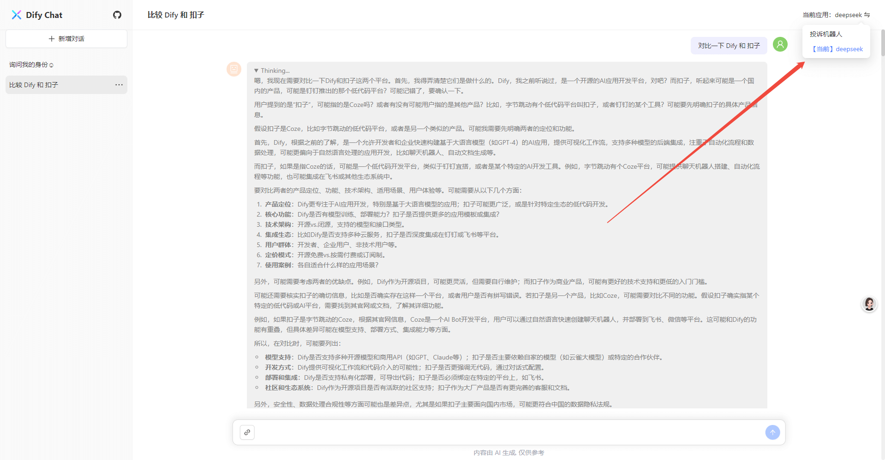

### 3. 自定义 `sys.user_id`

在 Dify 应用中，存在一个名为 `sys.user_id` 的变量，用于标识当前用户的 ID。

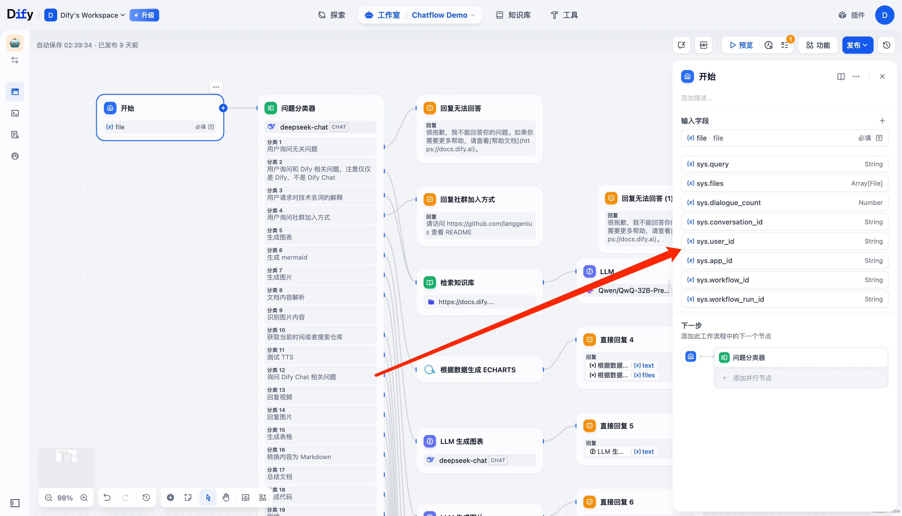

在本项目中，默认使用了 `FingerPrintJS` 来生成浏览器唯一的用户 ID，你可以在 `src/App.tsx` 中看到它的具体实现：

```tsx
import FingerPrintJS from "@fingerprintjs/fingerprintjs";

export default function App() {
  const [userId, setUserId] = useState<string>("");

  useMount(() => {
    // 模拟登录过程获取用户唯一标识
    const loadFP = async () => {
      const fp = await FingerPrintJS.load();
      const result = await fp.get();
      setUserId(result.visitorId);
    };
    loadFP();
  });

  return (
    <DifyChatProvider
      value={{
        // 用户id，可以获取业务系统的用户 ID，动态传入
        user: USER,
      }}
    >
      子组件
    </DifyChatProvider>
  );
}
```

当然，如果你的业务系统中已经有了用户 ID，你可以自行修改 `DifyChatProvider` 的 `user` 属性赋值逻辑。

### 4. 支持表单

Dify 支持通过 `jinja2` 来配置回复表单供用户填写，本项目也支持了对应的功能。

Dify Chatflow 编排的回复内容示例：

```html
<form data-format="json">
  <label for="username">用户名字:</label>
  <input type="text" name="username" value="{{ username }}" />
  <label for="phone">联系电话:</label>
  <input type="text" name="phone" value="{{ phone }}" />
  <label for="content">投诉内容:</label>
  <textarea name="content"></textarea>
  <button data-size="small" data-variant="primary">提交</button>
</form>
```

> 注意：
>
> - 你需要自行在 Chatflow 中对 `sys.query` 进行正确的逻辑处理，区分普通消息、触发表单的消息及提交信息。
> - form 标签的 `data-format` 属性用于指定表单数据的格式，目前支持 `json` 和 `text` 两种格式。

按照上面的内容回复后，默认情况下，在用户点击表单的提交按钮后，会将表单的值对象作为消息发送给同一个 Dify 应用，同时会在消息列表中展示。提交消息的示例文本：

```json
{
  "username": "lexmin",
  "phone": "13123456789",
  "content": "快递太慢啦，我要举报",
  "isFormSubmit": true
}
```

其中，`isFormSubmit` 字段用于标识这是一个表单提交的消息, 你可以在 Chatflow 编排的条件分支中使用它来进行判断消息类型。

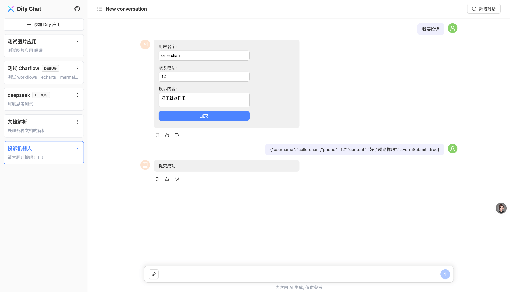

#### 4.1 自定义提交消息文本

如果你不想展示具体的表单值 json 字符串，而是需要自定义发送的消息文本，可以按照下面的指引，在应用配置中进行配置（此配置只影响界面展示，实际提交到 Dify Chatflow 开始节点的仍然是用户填写的表单值 json 字符串）。

**多应用模式**

在添加/更新应用配置弹窗中填写字段：

- 表单回复 - 设置为 "启用"
- 提交消息文本 - 用于替换表单值对象的文本，如 "我提交了一个表单"

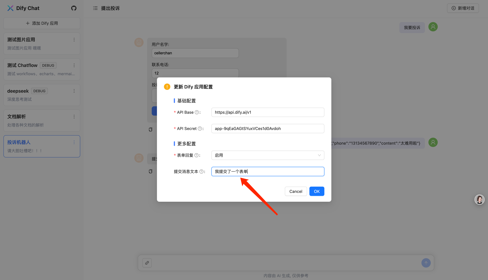

**单应用模式**

在入口文件中，添加对应的属性即可：

```tsx
export default function App() {
  return (
    <DifyChatProvider
      value={{
        mode: "singleApp",
        user: USER,
        appConfig: {
          requestConfig: {
            apiBase: "你的 API Base",
            apiKey: "你的 API Secret",
          },
          answerForm: {
            enabled: true,
            feedbackText: "我提交了一个表单",
          },
        },
      }}
    >
      子组件
    </DifyChatProvider>
  );
}
```

按照如上配置后，效果如下：


### 5. 支持应用输入参数

Dify 应用支持配置初始参数，在对话开启时，展示在界面上供用户输入。

默认情况下，同一个对话只允许输入一次参数值，在后续对话时，将会禁用输入控件。


#### 5.1 支持在对话开始后更新参数

在应用配置中，你可以选择是否允许用户在对话开始后更新参数值：

**单应用模式**：

增加 `inputParams.enableUpdateAfterCvstStarts` 配置项：

```tsx
export default function App() {
  return (
    <DifyChatProvider
      value={{
        ...其他配置,
        appConfig: {
          ...其他配置,
          inputParams: {
            // 是否允许用户在对话中更新参数值
            enableUpdateAfterCvstStarts: false,
          },
        },
      }}
    >
      子组件
    </DifyChatProvider>
  );
}
```

**多应用模式**：

在界面上编辑应用配置，将 "对话参数配置" 中的 "更新历史参数" 设为 "启用" 即可。


#### 5.2 读取 URL 作为应用参数

在实际应用场景下，我们可能有需要在 URL 中动态传入参数值，填入表单。

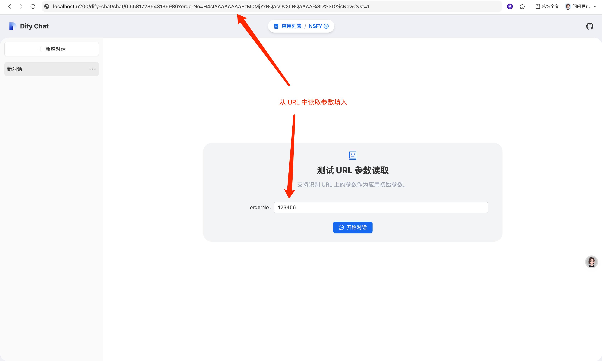

为了支持此功能，你的 URL 需要定义成如下形式：

```shell
<dify-chat-address>/dify-chat/app/<appId>?<paramName>=<encodedParamValue>&isNewCvst=1
```

#### 应用示例 - 订单号填入

默认情况下，对话参数的值为空：

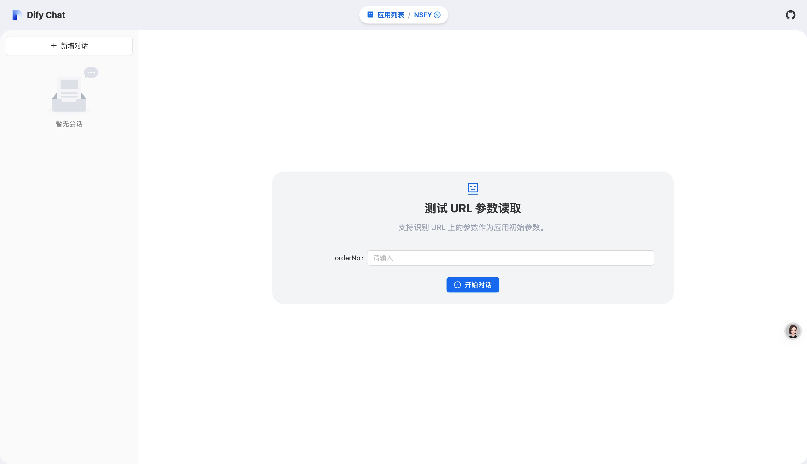

我们可以在 URL 中拼接参数：

```shell
http://localhost:5200/dify-chat/app/${appId}?orderNo=${encodedValue}&isNewCvst=1
```

说明：

- `appId`, 应用 ID
- `encodedValue`, 经过 `Gzip` 和 `encodeUriComponent` 处理后的参数值
- `isNewCvst`, 指定需要开启新对话（如果不指定且存在历史对话时，默认将会选中最近一个对话）

`encodedValue` 生成方式（NodeJS）：

```javascript
const zlib = require("zlib");

const originalOrderNo = "123456";
const buffer = Buffer.from(originalString, "utf8");
let encodedValue = "";

zlib.gzip(buffer, (err, compressedBuffer) => {
  if (err) {
    console.error("压缩时出错:", err);
    return;
  }
  const encodedString = compressedBuffer.toString("base64");
  encodedValue = encodeURIComponent(encodedString);
});
```

将 `encodedValue` 填入链接后访问，可以看到我们定义的 `orderNo: 123456` 已经被填入表单：

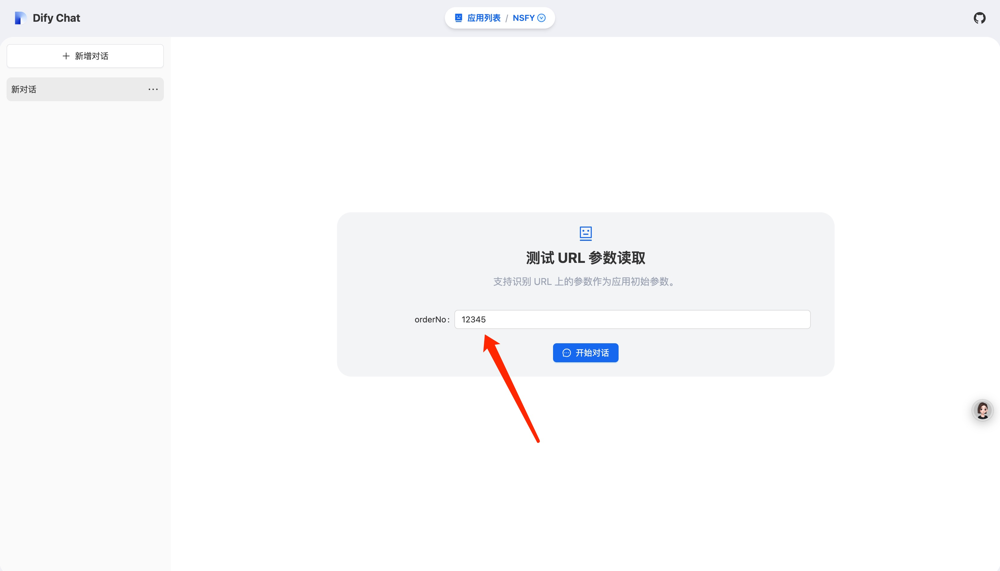

### 6. 其他配置

#### 6.1 开场白

Dify 应用支持配置开场白。

默认情况下，开场白在每个新对话开始前展示，当用户发送消息（即对话开始）后，开场白将被隐藏。

如果你希望在对话开始后展示开场白，可以在应用配置中进行配置：

**单应用模式**：

在入口文件中，添加对应的属性即可：

```tsx
export default function App() {
  return (
    <DifyChatProvider
      value={{
        ...其他配置,
        appConfig: {
          ...其他配置,
          extConfig: {
            conversation: {
              openingStatement: {
                // 配置开场白总是展示
                displayMode: 'always'
              }
            }
          },
        },
      }}
    </DifyChatProvider>
  )
}
```

**多应用模式**：

在界面上编辑应用配置，将 "对话配置" 中的 "开场白展示场景" 设为 "总是展示" 即可。

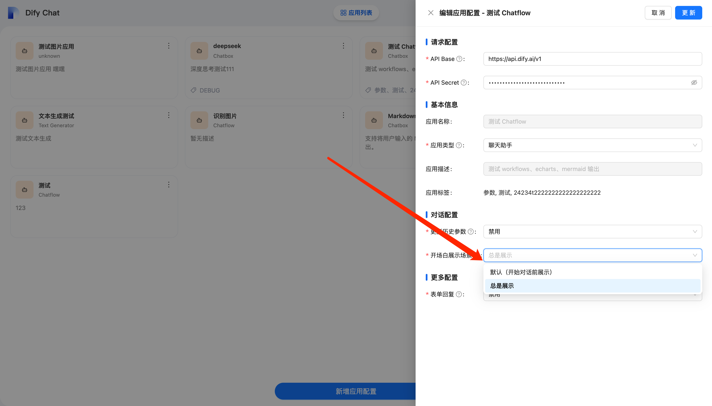

### 7. 跨域处理

Dify Cloud 以及私有化部署的 Dify 服务本身均支持跨域请求，无需额外处理，但如果你的私有化部署环境还存在额外的网关层，且对跨域资源访问有严格的限制，可能就会导致跨域问题，处理方式如下：

在你的网关层的响应 Header 处理中，增加 `Access-Control-Allow-Origin` 字段，允许 Dify-Chat 应用的部署域名访问，以 nginx 为例：

```bash
# nginx.conf
server {
  listen 443;
  server_name dify-chat.com # 这里换成你的前端部署域名

  location / {
    add_header Access-Control-Allow-Origin https://dify-chat.com; # 这里换成你的前端部署协议+域名
    add_header Access-Control-Allow-Methods 'GET, POST, PUT, DELETE, OPTIONS';
  }
}
```

## 本地开发

安装依赖:

```bash
pnpm install
```

启动开发服务器：

> 支持子包热更新，无需提前构建

```bash
pnpm dev
```

构建生产版本：

```bash
pnpm build
```

预览生产版本：

```bash
pnpm preview
```

## 容器运行

进入docker目录启动容器编排：

```bash
docker compose up dify-chat -d
```

浏览器访问http://127.0.0.1:8080/dify-chat/

容器默认暴露http端口8080，https端口8443，可修改.env文件配置环境变量

默认配置的docker镜像为多应用模式，如需自定义使用（如单应用模式）请自行构建docker镜像

## 使用certbot全自动签发letsencrypt免费ssl证书

在操作之前请编辑.env文件修改以下几个参数：

```bash
NGINX_HTTPS_ENABLED=true
#域名
NGINX_SERVER_NAME
#待申请证书的域名
CERTBOT_DOMAIN
NGINX_ENABLE_CERTBOT_CHALLENGE=true
#域名邮箱，随便写
CERTBOT_EMAIL
#更多证书申请参数，可留空
CERTBOT_OPTIONS
```

> 注意：请确保你配置的域名可以使用80端口访问到你的 dify-chat 站点，详见：https://eff-certbot.readthedocs.io/en/latest/install.html#alternative-1-docker

在docker目录执行命令即可全自动申请、签发证书：

```bash
docker-compose --profile certbot up
```

签发的证书在[docker/certbot/conf/live/你的域名]目录下。

注意：以上路径的证书文件为替身，如需将证书用在其他项目上需要在[docker/certbot/conf/archive/你的域名]目录下获取真实证书文件

```txt
`privkey.pem`  : the private key for your certificate.
`fullchain.pem`: the certificate file used in most server software.
`chain.pem`    : used for OCSP stapling in Nginx >=1.3.7.
`cert.pem`     : will break many server configurations, and should not be used
                 without reading further documentation (see link below).
```

![注意：证书需要定期续期]

## FAQ

A: pnpm install 报错 `Cannot find matching keyid: ${JSON.stringify({ signatures, keys })}`

Q: 先运行 `COREPACK_INTEGRITY_KEYS=0 corepack prepare` 再执行 `pnpm install`。

## Roadmap

- [x] 支持多个会话切换
- [x] 支持运行时用户自定义 Dify API 配置
- [x] 移动端适配
- [x] 消息更新时自动滚动到最底部
- [x] 拆分独立组件库，方便二次开发
- [x] 会话操作
  - [x] 支持会话重命名
- [x] 对话参数设置
  - [x] 支持修改对话参数
- [x] 消息发送区域功能
  - [x] 支持发送图片
  - [x] 支持发送其他类型的文件
  - [x] 支持打断输出
  - [x] 支持语音输入转文字
- [x] 消息内容渲染
  - [x] 支持深度思考标签展示（如 DeepSeek-R1 的输出）
  - [x] 支持工作流信息展示
  - [x] 支持思维链展示
  - [x] 支持知识库引用列表展示
  - [x] 支持图片展示
  - [x] 支持图片放大查看
  - [x] 支持 `Echarts` 渲染
  - [x] 支持数学公式渲染
  - [x] 支持文件卡片渲染
  - [x] 支持 `Mermaid` 渲染
  - [x] 支持图片/视频
- [x] 消息内容交互
  - [x] 支持内容复制
  - [x] 支持点赞/点踩
  - [x] 支持消息文件点击下载
  - [x] 支持回复表单展示和提交
  - [x] 支持文字转语音
- [x] 支持多应用模式
  - [x] Localstorage 实现
  - [x] Restful API 实现
  - [x] 支持自定义后端服务
  - [x] 配置和切换功能分离，支持隐藏配置入口
- [x] 支持单应用模式
  - [ ] 支持用户在界面上变更配置
- [x] 子包发布
  - [x] 发布 `@dify-chat/core` 包
  - [x] 发布 `@dify-chat/helpers` 包
  - [x] 发布 `@dify-chat/api` 包
  - [x] 发布 `@dify-chat/components` 包
- [ ] 国际化
- [ ] 支持单个会话视图
- [ ] 支持消息触顶/触底自动分页加载
- [x] 支持回复重新生成
- [x] 支持夜间模式
- [ ] 支持自定义主题
- [ ] 补充不同类型应用场景的最佳实践
- [ ] 容器化部署支持

## License

[MIT](./LICENSE)

## Star History

[](https://www.star-history.com/#lexmin0412/dify-chat&Date)
