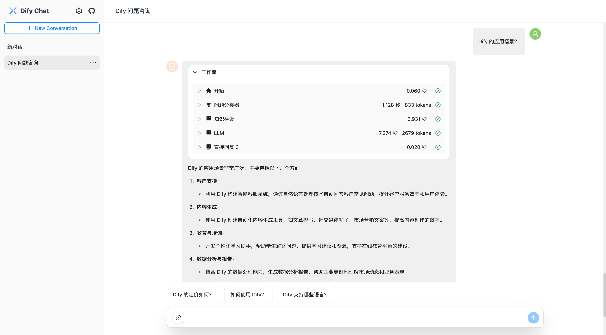
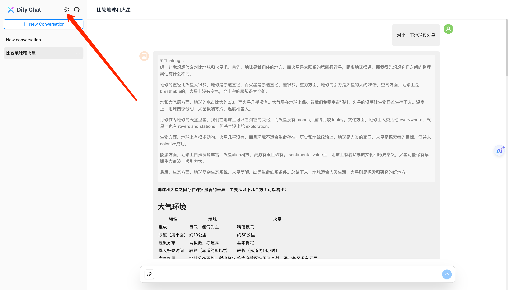
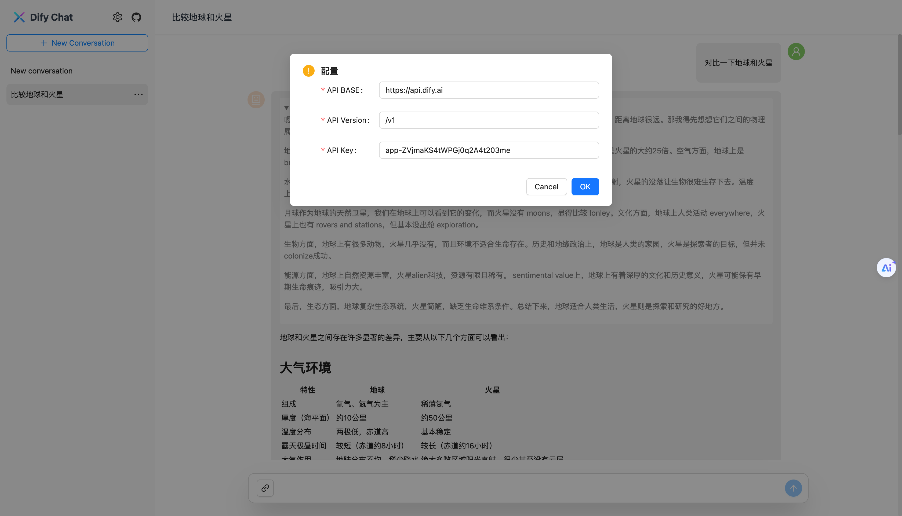
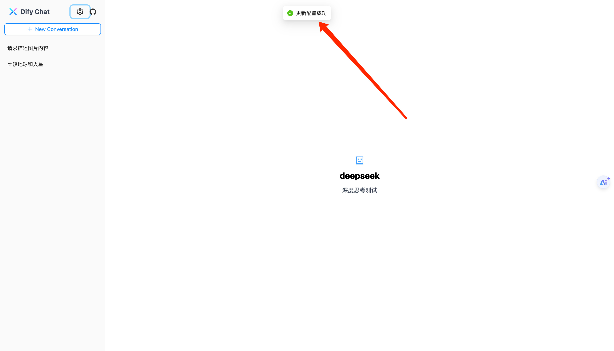

# Dify Chat Web

一个基于 Dify API 的 AI 会话 Web APP, 适配深度思考、Dify Chatflow/Workflow 应用、Agent 思维链输出信息。

## 运行截图

`<think>` 标签（DeepSeek 深度思考）：


Chatflow 工作流：



## 特性

- 💃 灵活部署：支持接入 Dify Cloud 及私有化部署的 API 服务，满足不同环境需求
- 🚀 高效集成：提供可复用的 React 组件，快速嵌入现有应用，加速开发进程
- 🎨 风格适配：支持自定义样式与主题，轻松与业务系统风格保持一致
- ⚙️ 配置灵活：支持编译时和运行时配置，适应多样化的使用场景

## 技术栈

- React v18
- Ant Design v5
- Ant Design X v1
- Rsbuild v1
- Tailwind CSS v3
- TypeScript v5

## 开始

### 1. 确定配置方式

我们支持让用户在运行时手动配置 Dify 相关信息（ API 服务器域名和 API Key），也支持开发者通过指定环境变量的方式，统一指定配置。

#### 1.1 获取配置

无论采取哪种配置方式，你都需要在 Dify 控制台获取几个关键变量：

- API 服务器域名
- API 版本，固定为 `/v1`
- API Key

进入 Dify 的应用详情，点击左侧的 `访问 API`：


`API 服务器` 后展示的域名即为 API 服务器域名，域名后即为 API 版本，固定为 `/v1`。

点击右侧的 `API 密钥` 按钮，即可看到 API Key 的管理弹窗：


你可以选择创建一个新的 API Key，或者复制现有的 API Key。


完成以上步骤后，我们将会得到如下信息：

- API 服务器域名: `https://api.dify.ai` OR 私有化部署后的 API 域名
- API 版本: `/v1`
- API Key: `app-YOUR_API_KEY`

#### 1.2 运行时配置

点击页面左上角的配置按钮，即可进入运行时配置页面：



依次填入我们在上一步中获取的信息：



点击确定按钮，提示 “更新配置成功”，将会重新加载应用信息：



#### 1.3. 编译时配置

如果你想在编译时注入配置，所有访问者都使用同一个身份，并且在本地开发时模拟相似的环境，可以在根目录创建一个 `.env.local` 文件，并添加以下环境变量（仍然是依次填入上一步获取到的信息）:

```bash
# .env.local
DIFY_API_BASE=https://api.dify.ai
DIFY_API_VERSION=/v1
DIFY_API_KEY=app-YOUR_API_KEY
```

Rsbuild 在编译时会自动读取这些环境变量，并将其注入到代码中，你可以在代码中使用 `process.env.DIFY_API_BASE` 来访问它们。

### 2. 本地开发

安装依赖:

```bash
pnpm install
```

启动开发服务器：

```bash
pnpm dev
```

构建生产版本：

```bash
pnpm build
```

预览生产版本：

```bash
pnpm preview
```

## Roadmap

- [x] 支持多个会话切换
- [x] 支持点赞/点踩
- [x] 支持消息内容复制
- [x] 支持运行时用户自定义 Dify API 配置
- [x] 兼容 Dify 老版本(<1.0)的消息列表格式
- [x] 支持会话重命名
- [x] 支持深度思考标签（如 DeepSeek-R1 的输出）
- [x] 支持对话时发送图片、消息列表展示图片
- [x] 支持 AI 回复消息展示 Dify 工作流信息及执行状态
- [x] 支持展示思维链
- [x] 支持打断输出
- [x] 移动端适配
- [x] 支持知识库引用列表展示 
- [ ] 支持单个会话视图
- [ ] 支持消息触顶/触底自动分页加载
- [ ] 支持回复重新生成、父级消息
- [ ] 支持夜间模式
- [ ] 支持自定义主题
- [ ] 拆分独立组件库，方便二次开发
- [ ] 补充不同类型应用场景的最佳实践
