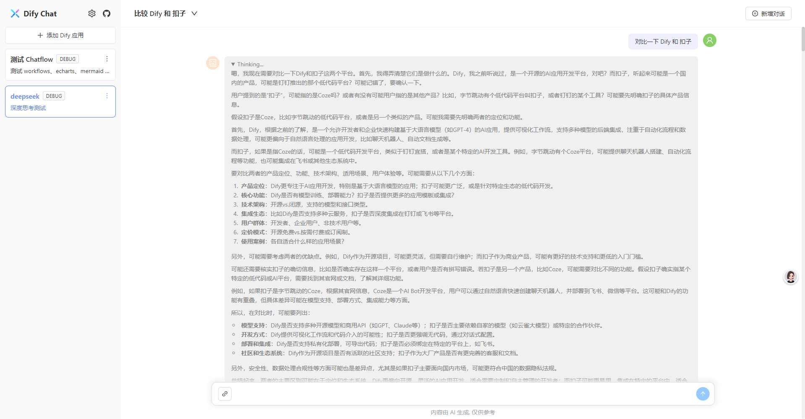
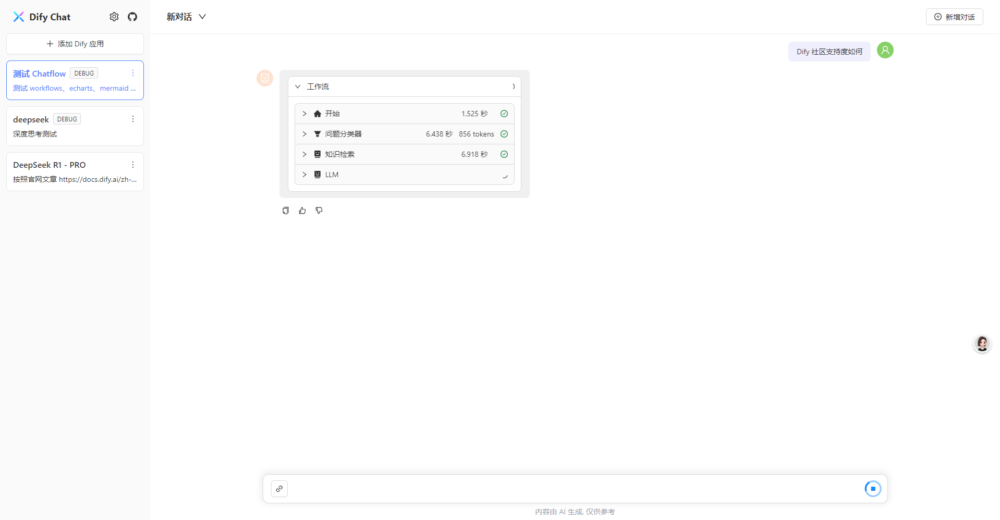
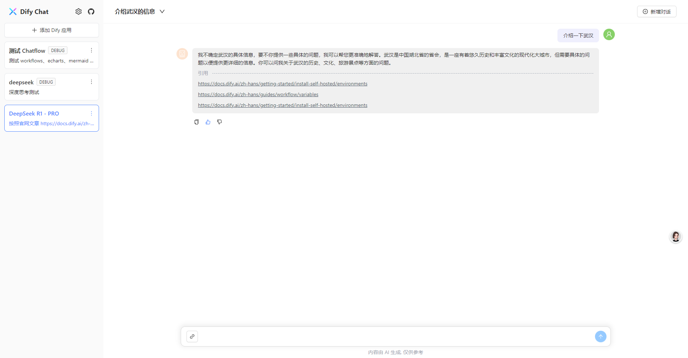
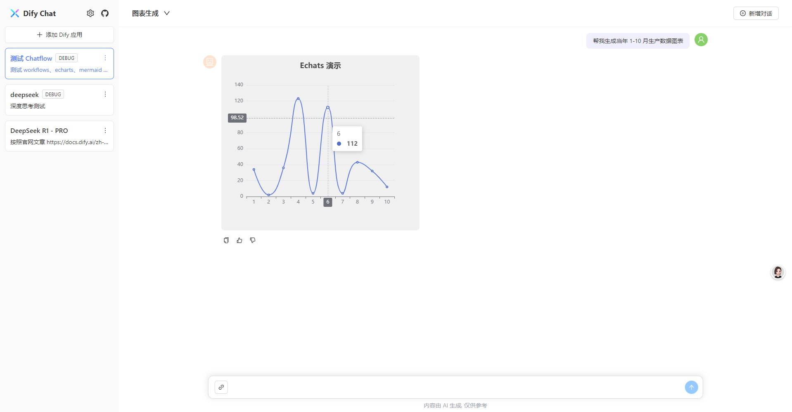
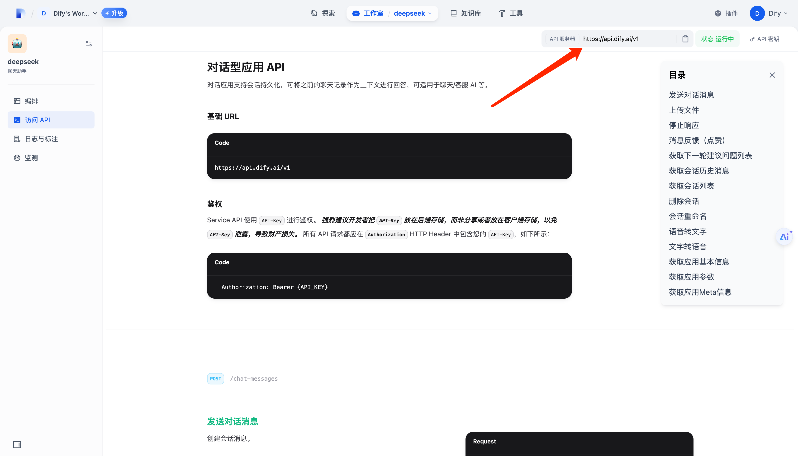
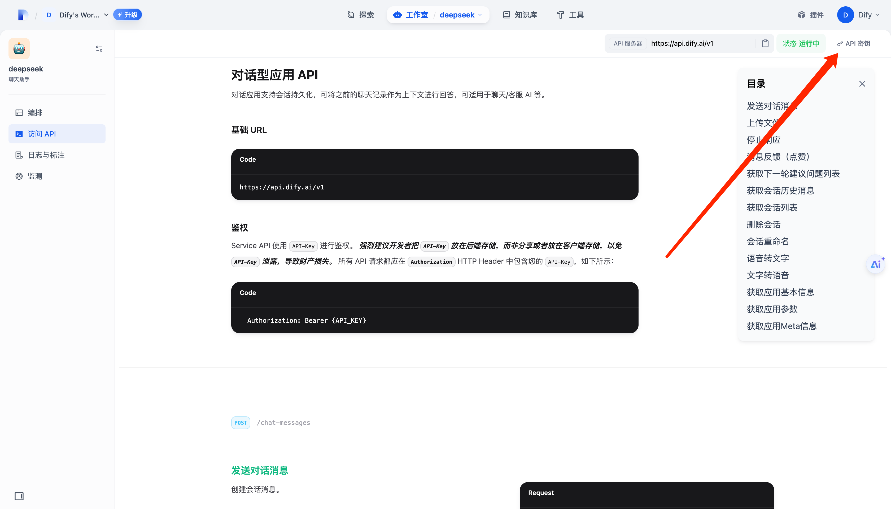
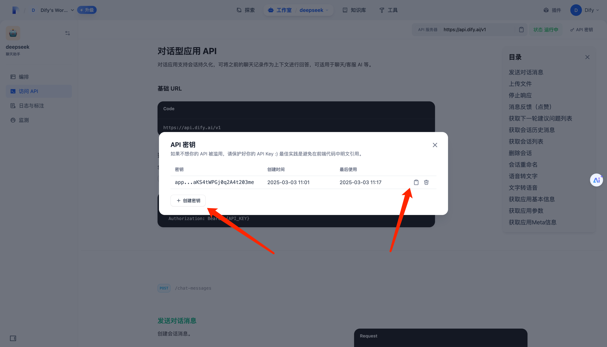
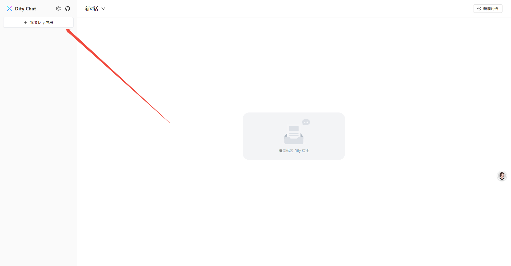
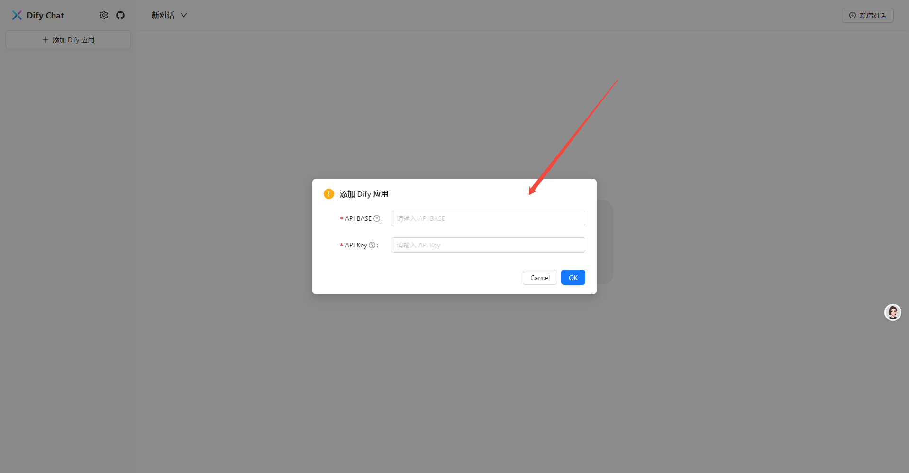
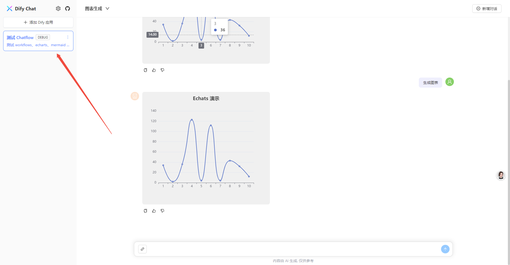

# Dify Chat Web

一个基于 Dify API 的 AI 会话 Web APP, 适配深度思考、Dify Chatflow/Workflow 应用、Agent 思维链输出信息。

## 运行截图

`<think>` 标签（DeepSeek 深度思考）：



Chatflow 工作流：



知识库引用链接：



`Echarts` 图表：

   

## 特性

- 💬 多场景兼容: 支持多应用、多会话视图，支撑不同业务场景
- 💃 灵活部署：自身无任何后端依赖，可无缝接入 Dify Cloud 及私有化部署的 API 服务
- 🚀 高效集成：提供高度可复用的 React 组件，加速开发进程
- 🎨 风格适配：支持深度自定义样式与主题，轻松契合业务系统独特风格

## 技术栈

- React v18
- Ant Design v5
- Ant Design X v1
- Rsbuild v1
- Tailwind CSS v3
- TypeScript v5

## 运行环境

开发/生产构建环境要求：

- Node.js v18.17.1+
- pnpm v8.x

> 注意：本应用使用了 pnpm workspace 来实现 Monorepo 管理，其他包管理工具可能无法正常工作，请先确保你的环境满足以上要求。

## 开始使用

### 1. 获取 Dify 应用配置

为了在此应用对接 Dify API，你需要在 Dify 控制台获取几个关键变量：

|变量|说明|
|---|---|
|API Base|Dify API 请求前缀, 如果你使用的是 Dify 官方提供的云服务，则为 `https://api.dify.ai/v1`|
|Api Key|Dify API 密钥，用于访问对应应用的 API, Dify 应用和 API 密钥是一对多的关系|

进入 Dify 的应用详情，点击左侧的 `访问 API`：



`API 服务器` 后展示的域名即为 `API Base` 变量的值。

点击右侧的 `API 密钥` 按钮，即可看到 API Key 的管理弹窗：



你可以选择创建一个新的 API Key，或者复制现有的 API Key。



完成以上步骤后，我们将会得到如下信息：

- API Base: `https://api.dify.ai/v1` OR `${SELF_HOSTED_API_DOMAIN}/v1`
- API Key: `app-YOUR_API_KEY`

### 1.2 在界面上添加 Dify 应用配置

点击页面左上角 "添加 Dify 应用配置" 按钮：



即可看到添加配置弹窗，依次填入我们在上一步中获取的信息：



点击确定按钮，提示 “添加配置成功”，即可在左侧的应用列表中多出了一条数据：



### 1.3 跨域处理

Dify Cloud 以及私有化部署的 Dify 服务本身均支持跨域请求，无需额外处理，但如果你的私有化部署环境还存在额外的网关层，且对跨域资源访问有严格的限制，可能就会导致跨域问题，处理方式如下：

#### 1.3.1 生产构建模式(pnpm build)

在你的网关层的响应 Header 处理中，增加 `Access-Control-Allow-Origin` 字段，允许 Dify-chat 应用的部署域名访问，以 nginx 为例：

```bash
# nginx.conf
server {
  listen 443;
  server_name dify-chat.com # 这里换成你的前端部署域名

  location / {
    add_header Access-Control-Allow-Origin https://dify-chat.com; # 这里换成你的前端部署协议+域名
    add_header Access-Control-Allow-Methods 'GET, POST, PUT, DELETE, OPTIONS';
  }
}
```

#### 1.3.2 本地开发模式(pnpm dev)

在项目根目录新建 `.env.local` 文件，添加以下内容：

```bash
# .env.local
DIFY_API_DOMAIN=https://api.dify.ai # 换成你的 API 部署域名
DIFY_API_PREFIX=/v1 # API 访问前缀，如果你没有对 Dify 进行魔改的话，一般就是 /v1
```

然后，你需要在界面上修改上一步中 API Base 的配置：

- 修改前: `${SELF_HOSTED_API_DOMAIN}/v1`
- 修改后: `/v1`

在运行 `pnpm dev` 时，Rsbuild 会自动读取 `.env.local` 文件中的环境变量，设置正确的 `server.proxy` 实现本地代理，可以访问 `rsbuild.config.ts` 文件查看详情。

## 本地开发

安装依赖:

```bash
pnpm install
```

启动开发服务器：

```bash
pnpm dev
```

构建生产版本：

```bash
pnpm build
```

预览生产版本：

```bash
pnpm preview
```

## Roadmap

- [x] 支持多个会话切换
- [x] 支持运行时用户自定义 Dify API 配置
- [x] 移动端适配
- [x] 消息更新时自动滚动到最底部
- [x] 拆分独立组件库，方便二次开发
- [x] 会话操作
  - [x] 支持会话重命名
- [x] 消息发送区域功能
  - [x] 支持发送图片
  - [x] 支持打断输出
- [x] 消息内容渲染
  - [x] 支持深度思考标签展示（如 DeepSeek-R1 的输出）
  - [x] 支持工作流信息展示
  - [x] 支持思维链展示
  - [x] 支持知识库引用列表展示 
  - [x] 支持图片展示
  - [x] 支持图片放大查看
  - [x] 支持 `Echarts` 渲染
  - [x] 支持数学公式渲染
- [x] 消息内容交互
  - [x] 支持内容复制
  - [x] 支持点赞/点踩
- [x] 支持多 Dify 应用管理
- [ ] 国际化
- [ ] 支持单个会话视图
- [ ] 支持消息触顶/触底自动分页加载
- [ ] 支持回复重新生成、父级消息
- [ ] 支持夜间模式
- [ ] 支持自定义主题
- [ ] 补充不同类型应用场景的最佳实践

## License

[MIT](./LICENSE)