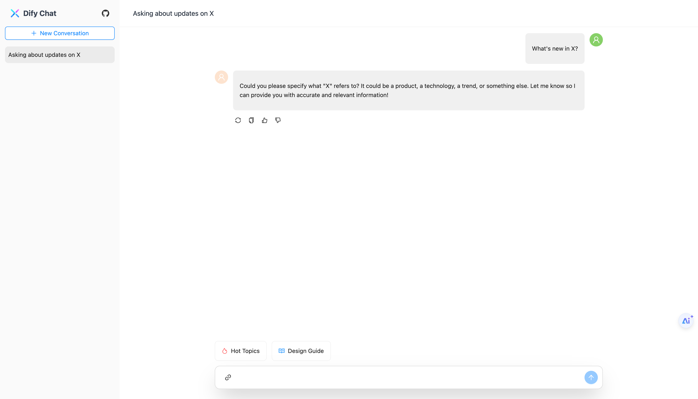

# Dify Chat Web

一个基于 Dify API 的 AI 会话 Web 应用。



## 特性

- 灵活部署，支持接入 Dify Cloud 和私有化部署的 API 服务
- 高效接入，提供可复用的 React 组件，快速嵌入现有应用
- 快速适配，支持自定义样式和主题，与业务系统风格保持统一
- 为你所用，同时支持编译时和运行时配置，满足不同场景需求

## 技术栈

- React v18
- Ant Design v5
- Ant Design X v1
- Rsbuild v1
- Tailwind CSS v3
- TypeScript v5

## 开始

在根目录创建一个 `.env.local` 文件，并添加以下环境变量:

```bash
# Dify API 域名，如果是私有化部署，请修改为你的域名
DIFY_API_BASE=https://api.dify.ai
# Dify API 版本，固定为 /v1
DIFY_API_VERSION=/v1
# Dify API Key，在 Dify 控制台获取，生成的是一个 app- 开头的 key
DIFY_API_KEY=app-YOUR_API_KEY
```

安装依赖:

```bash
pnpm install
```

启动开发服务器：

```bash
pnpm dev
```

构建生产版本：

```bash
pnpm build
```

预览生产版本：

```bash
pnpm preview
```

## Roadmap

- [x] 支持多个会话切换
- [x] 支持点赞/点踩
- [x] 支持消息内容复制
- [x] 支持运行时用户自定义 Dify API 配置
- [x] 兼容 Dify 老版本(<1.0)的消息列表格式
- [ ] 支持消息触顶/触底自动分页加载
- [ ] 支持会话重命名
- [ ] 支持展示思维链
- [ ] 支持单个会话视图
- [ ] 支持回复重新生成、父级消息
- [ ] 移动端适配